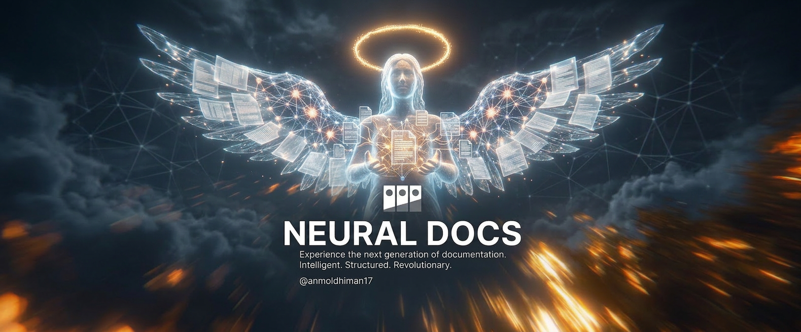
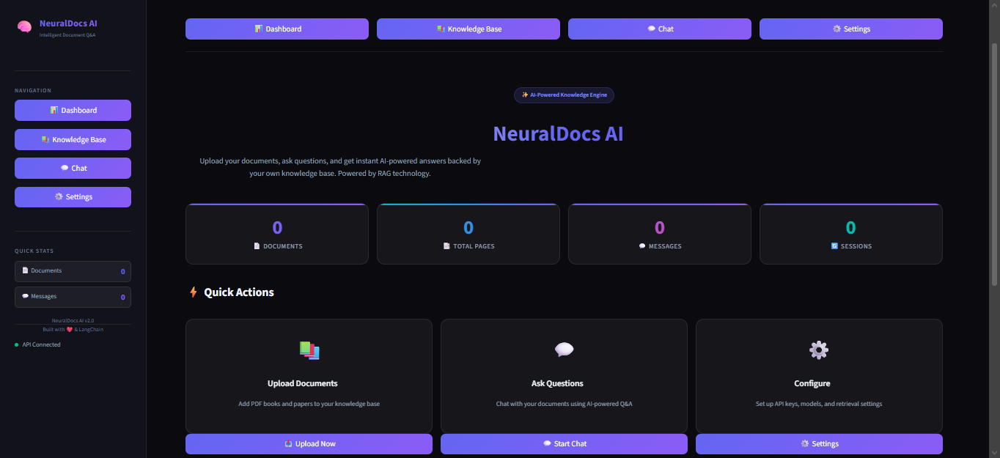
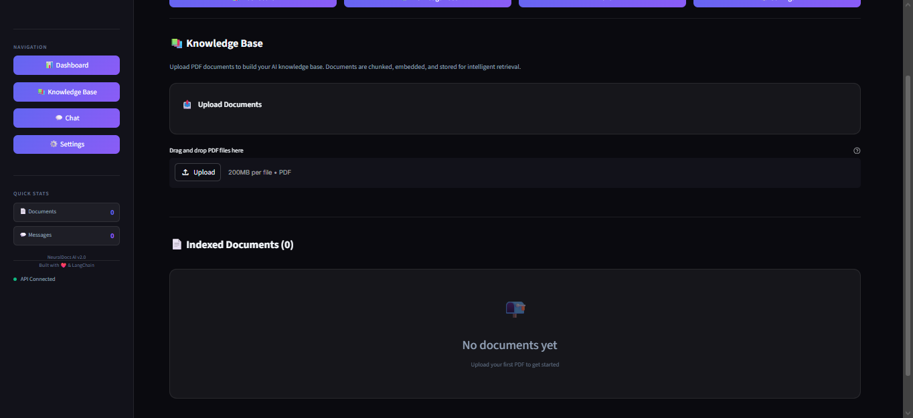
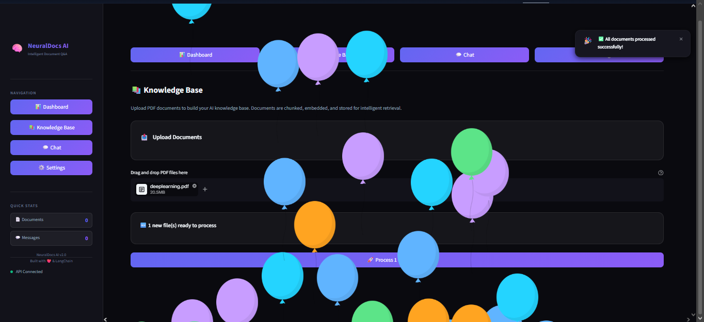
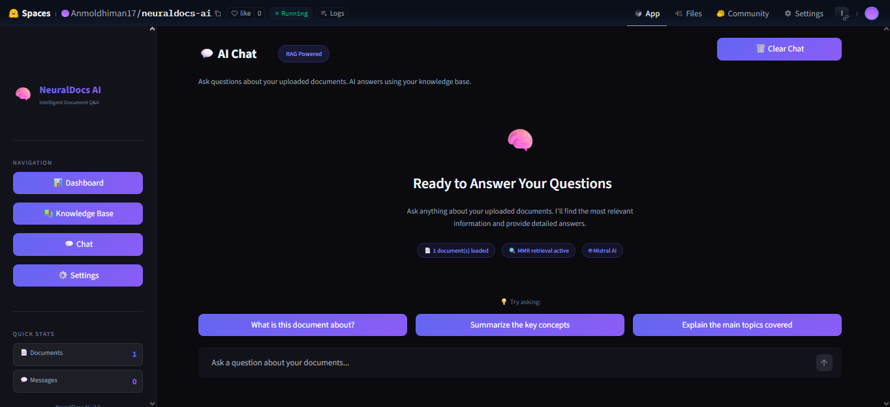
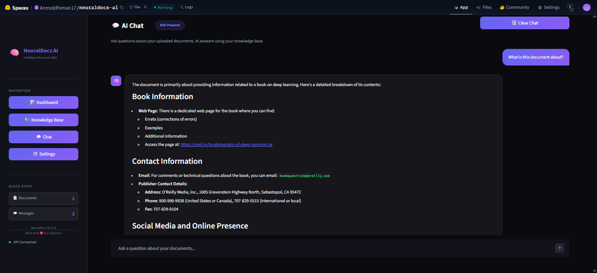
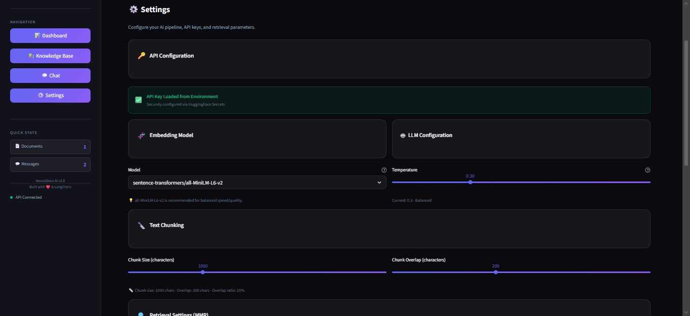
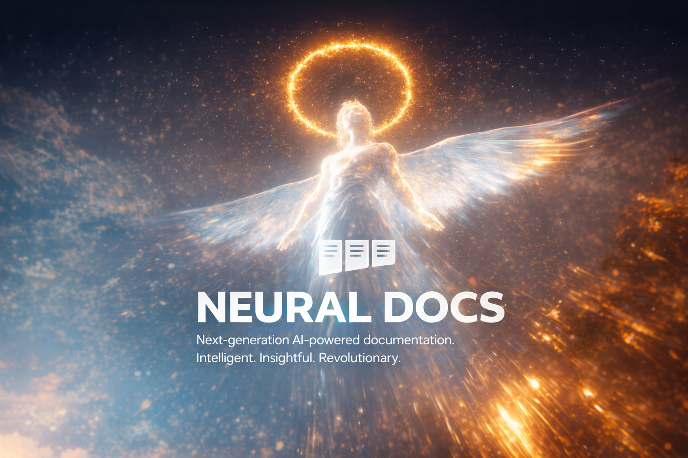

<div align="center">

<!-- ═══════════════════════════════════════════════════════════ -->
<!--                      HERO BANNER                           -->
<!-- Upload image 1 (wide angel + docs) as assets/banner.png   -->
<!-- ═══════════════════════════════════════════════════════════ -->


<br/><br/>

<!-- ANIMATED TYPING -->
<a href="https://git.io/typing-svg">
  
</a>

<br/><br/>

<!-- BADGES ROW 1 -->
<a href="https://huggingface.co/spaces/Anmoldhiman17/neuraldocs-ai">
  
</a>
<a href="https://github.com/anmoldhiman17/neuraldocs-ai">
  
</a>
<a href="https://github.com/anmoldhiman17/neuraldocs-ai/stargazers">
  
</a>

<br/><br/>

<!-- BADGES ROW 2 -->


<br/><br/>

---

</div>

<br/>

## 🌌 What is NeuralDocs AI?


> **NeuralDocs AI** is a full-stack **Retrieval-Augmented Generation (RAG)** application that turns your static PDF documents into a living, queryable intelligence layer — powered by vector embeddings and large language models.

- 📤 **Upload** any PDF document
- ⚡ **Process** it into semantic chunks with embeddings
- 💬 **Chat** with your documents in real time
- 🔍 **Get answers** grounded in your actual content — no hallucinations

Built for researchers, students, and knowledge workers who need more than a keyword search.

<br clear="right"/>

<br/>

---

## ✨ Feature Highlights

<div align="center">

| 🔍 Smart Retrieval | 💬 Chat Interface | 📄 Doc Management |
|---|---|---|
| MMR-based diversity ranking | ChatGPT-style conversation | Drag & drop multi-PDF upload |
| ChromaDB vector persistence | Full conversation history | Per-document page & chunk stats |
| Configurable k, fetch-k, λ | Source attribution per reply | Search, filter & delete docs |

| ⚙️ Full Control | 📱 Mobile Ready | 🔐 Secure |
|---|---|---|
| Chunk size & overlap tuning | Sticky top nav for mobile | API key via HF Secrets |
| LLM temperature control | Responsive across all screens | Never exposed in UI |
| Embedding model selection | "Start Chatting →" shortcut | `/tmp` filesystem compliance |

</div>

<br/>

---

## 📸 Screenshots

<div align="center">



<br/>
<sub>🏠 <b>Main Dashboard</b> — Overview of documents, pages, messages & sessions with quick-action shortcuts</sub>

<br/><br/>


&nbsp;


<br/>
<sub>📚 <b>Knowledge Base</b> — Drag-and-drop PDF upload (left) &nbsp;·&nbsp; Real-time processing with success toast (right)</sub>

<br/><br/>


&nbsp;


<br/>
<sub>💬 <b>AI Chat</b> — Ready state with suggested prompts (left) &nbsp;·&nbsp; Structured document-grounded answer (right)</sub>

<br/><br/>



<br/>
<sub>⚙️ <b>Settings</b> — Full control over embedding model, LLM temperature, chunk size, overlap & MMR retrieval parameters</sub>

</div>

> 📂 Place your screenshots in `assets/screenshots/` — filenames: `interface.png`, `knowledge_base.png`, `knowledge_base_processing.png`, `ai_chat.png`, `ai_chat_response.png`, `settings.png`

<br/>

---

## 🏗️ System Architecture

```
╔══════════════════════════════════════════════════════════════════╗
║                        NeuralDocs AI                            ║
║                     Streamlit Frontend                          ║
╠══════════════╦═══════════════════════╦════════════════════════╣
║  📚 Knowledge║    💬 Chat Interface  ║    ⚙️ Settings          ║
║  Base Page   ║   Query → RAG → LLM  ║  Config & Tuning        ║
╠══════════════╩═══════════════════════╩════════════════════════╣
║                      backend/                                   ║
║  ┌──────────────┐  ┌──────────────┐  ┌─────────────────────┐  ║
║  │ PyPDFLoader  │  │  Retriever   │  │    RAG Pipeline     │  ║
║  │ + Splitter   │→ │  MMR Search  │→ │  Mistral AI LLM     │  ║
║  └──────┬───────┘  └──────┬───────┘  └─────────────────────┘  ║
║         │                 │                                     ║
║  ┌──────▼───────┐  ┌──────▼───────┐                           ║
║  │  HuggingFace │  │   ChromaDB   │                           ║
║  │  Embeddings  │→ │ Vector Store │                           ║
║  │ all-MiniLM   │  │  /tmp/       │                           ║
║  └──────────────┘  └──────────────┘                           ║
╚══════════════════════════════════════════════════════════════════╝
```

<br/>

---

## 🚀 Quick Start

### Prerequisites

```bash
Python >= 3.11
Mistral AI API Key  →  https://console.mistral.ai/
```

### 1️⃣ Clone

```bash
git clone https://github.com/anmoldhiman17/neuraldocs-ai.git
cd neuraldocs-ai
```

### 2️⃣ Install

```bash
python -m venv venv
source venv/bin/activate          # macOS/Linux
# venv\Scripts\activate           # Windows

pip install -r requirements.txt
```

### 3️⃣ Configure

```bash
export MISTRAL_API_KEY="your_mistral_api_key_here"
```

### 4️⃣ Launch 🎉

```bash
streamlit run app.py
```

Open → **http://localhost:8501**

<br/>

---

## ☁️ Deploy on HuggingFace Spaces

<div align="center">
<a href="https://huggingface.co/spaces/Anmoldhiman17/neuraldocs-ai">

</a>
</div>

<br/>

**Steps to deploy your own:**

```bash
# 1. Create a new Streamlit Space on huggingface.co/new-space

# 2. Add HuggingFace as a remote
git remote add hf https://huggingface.co/spaces/YOUR_USERNAME/neuraldocs-ai

# 3. Push
git push hf main

# 4. Add secret in Space Settings → Repository Secrets:
#    MISTRAL_API_KEY = your_key_here
```

> ⚠️ **HuggingFace filesystem note:** The app automatically writes to `/tmp/` for all uploads and ChromaDB. Data resets on Space restart. For persistent storage, connect a HuggingFace Dataset.

<br/>

---

## 📁 Project Structure

```
neuraldocs-ai/
│
├── 🚀 app.py                      ← Main entry point + navigation
│
├── 📂 pages/
│   ├── dashboard.py               ← Overview stats
│   ├── knowledge_base.py          ← PDF upload & management
│   ├── chat.py                    ← RAG chat interface
│   └── settings.py                ← Config panel
│
├── 📂 backend/
│   ├── database.py                ← ChromaDB vector store CRUD
│   ├── embeddings.py              ← HuggingFace embedding loader
│   ├── retriever.py               ← MMR retriever setup
│   ├── rag_pipeline.py            ← Full RAG chain
│   └── utils.py                   ← Shared helpers
│
├── 📂 assets/
│   ├── banner.png                 ← Header banner image  ← ADD THIS
│   ├── footer.png                 ← Footer banner image  ← ADD THIS
│   ├── 📂 screenshots/            ← App screenshots      ← ADD THIS
│   │   ├── interface.png
│   │   ├── knowledge_base.png
│   │   ├── knowledge_base_processing.png
│   │   ├── ai_chat.png
│   │   ├── ai_chat_response.png
│   │   └── settings.png
│   └── style.css                  ← Dark glassmorphism theme
│
├── 📂 .streamlit/
│   └── config.toml                ← Server config (CORS, upload limits)
│
├── 🐳 Dockerfile                  ← HuggingFace Docker config
└── 📦 requirements.txt
```

<br/>

---

## 🧬 Tech Stack

<div align="center">

| Layer | Technology | Role |
|---|---|---|
| 🖼️ **Frontend** | Streamlit | UI, pages, file upload, chat |
| 🤖 **LLM** | Mistral AI `mistral-small-2506` | Answer generation |
| 🧬 **Embeddings** | HuggingFace `all-MiniLM-L6-v2` | Semantic vectorization |
| 🗄️ **Vector DB** | ChromaDB | Embedding persistence & search |
| 🔗 **RAG Framework** | LangChain | Load → Split → Retrieve → Generate |
| 📄 **PDF Parsing** | PyPDFLoader | Text extraction from PDFs |
| 🔍 **Retrieval** | MMR (Maximal Marginal Relevance) | Diverse, relevant chunk selection |
| ☁️ **Hosting** | HuggingFace Spaces (Docker) | Cloud deployment |

</div>

<br/>

---

## ⚙️ Configuration Reference

| Parameter | Default | Range | Description |
|---|---|---|---|
| `embedding_model` | `all-MiniLM-L6-v2` | — | Vectorization model |
| `chunk_size` | `1000` | 200–3000 | Characters per chunk |
| `chunk_overlap` | `200` | 0–500 | Overlap between chunks |
| `retrieval_k` | `6` | 1–20 | Chunks returned per query |
| `retrieval_fetch_k` | `20` | 5–50 | MMR candidate pool size |
| `retrieval_lambda` | `0.5` | 0–1 | Diversity ↔ Relevance tradeoff |
| `temperature` | `0.3` | 0–1 | LLM creativity level |

<br/>

---

## 📊 How RAG Works

```
 User Query
     │
     ▼
┌─────────────────┐
│  Embed Query    │  ← same embedding model as docs
│  (MiniLM)       │
└────────┬────────┘
         │  query vector
         ▼
┌─────────────────┐
│  ChromaDB MMR   │  ← fetch 20 candidates, return top 6
│  Retrieval      │     diverse & relevant chunks
└────────┬────────┘
         │  retrieved chunks
         ▼
┌─────────────────┐
│  Prompt Builder │  ← system prompt + context + question
│  (LangChain)    │
└────────┬────────┘
         │  final prompt
         ▼
┌─────────────────┐
│  Mistral AI LLM │  ← grounded, document-aware answer
│  mistral-small  │
└────────┬────────┘
         │
         ▼
   Answer + Sources  →  Displayed in Chat UI
```

<br/>

---

## 🗺️ Roadmap

- [x] ✅ Multi-PDF upload & processing
- [x] ✅ MMR retrieval with configurable parameters
- [x] ✅ Mobile-responsive navigation
- [x] ✅ API key security via HF Secrets
- [x] ✅ Active-document filtering (no stale sources)
- [ ] 🌐 Web URL ingestion (scrape & embed web pages)
- [ ] 🗂️ Multi-collection knowledge bases
- [ ] 🔗 HuggingFace Datasets for persistent storage
- [ ] 📤 Export chat history as PDF / Markdown
- [ ] 🌍 Multilingual document support
- [ ] 🧑‍🤝‍🧑 Multi-user isolated sessions

<br/>

---

## 🤝 Contributing

```bash
# 1. Fork → Clone
git clone https://github.com/YOUR_USERNAME/neuraldocs-ai.git

# 2. Create branch
git checkout -b feat/your-feature

# 3. Commit (Conventional Commits)
git commit -m "feat: describe your change"

# 4. Push + Open PR
git push origin feat/your-feature
```

All contributions welcome — bug fixes, features, docs, UI improvements.

<br/>

---

## 📄 License

Distributed under the **MIT License**. See [`LICENSE`](LICENSE) for details.

<br/>

---

<!-- ═══════════════════════════════════════════════════════════ -->
<!--                      FOOTER BANNER                         -->
<!-- Upload image 2 (vertical angel + cosmos) as assets/footer.png -->
<!-- ═══════════════════════════════════════════════════════════ -->

<div align="center">



<br/><br/>

**Made with ❤️ by [Anmol Dhiman](https://github.com/anmoldhiman17)**

*LangChain · ChromaDB · Mistral AI · Streamlit · HuggingFace*

<br/>

[](https://github.com/anmoldhiman17/neuraldocs-ai/stargazers)
&nbsp;&nbsp;
[](https://github.com/anmoldhiman17)

<br/>

> *"The best way to understand a document is to have a conversation with it."*

</div>
